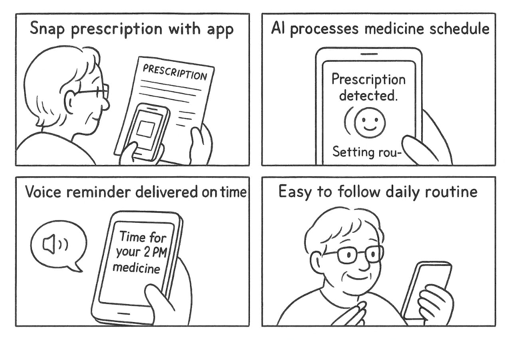
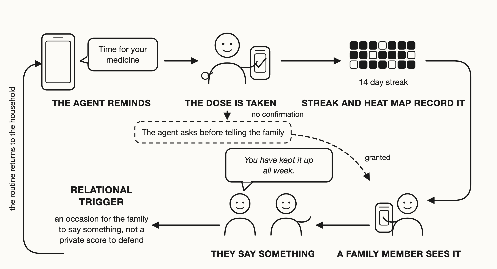

# Introduction

A missed dose can create a difficult choice: should an older adult
manage it independently, or should a family member step in? Family
involvement can support medication routines [@92], yet the same checking
can shift privacy, responsibility, and control [@24; @115]. This tension
matters especially in many Global South households, where medication
work often extends across relatives, shared devices, and intermediated
technology use [@3; @98]. Reminding, purchasing medicines, interpreting
prescriptions, and checking doses can therefore be part of everyday
family care rather than separate acts of assistance. Medication
adherence is more than a problem of remembering. It is also a continuing
negotiation over who notices, who acts, and who takes responsibility
when a routine breaks down.

Family support can preserve older adults' agency, but it can also redraw
its boundaries. Older adults may rely on others for assistance while
still wanting control over how support and health information are shared
[@13; @24; @30; @50]. Interdependence and aging scholarship similarly
shows that receiving assistance need not diminish agency because people
can rely on others while retaining a meaningful role in how support is
arranged [@13; @30; @33]. Yet those boundaries can change across
situations: checking may communicate care at one moment and feel like
unwanted oversight at another [@24; @115]. Designing for medication
adherence therefore requires support for these shifts without assuming
that either independence or family involvement should always take
priority.

This negotiation becomes harder when medication technology can act
before anyone explicitly asks it to. Mixed-initiative systems have long
considered when computational systems should take initiative, while
newer proactive agents can intervene in communication or propose actions
on a person's behalf [@45; @52]. In medication care, an AI agent might
notice an unconfirmed dose and ask whether a relative should be
involved. If the agent keeps the missed dose private, the older adult
retains control, but the caregiver may remain unaware. Involving the
family can bring support, while also expanding who knows about the dose
and who becomes responsible for responding. The AI agent therefore
becomes a participant in deciding how responsibility moves between
older-adult control and family involvement.

We call this relationship **allegiance**: whose interests and authority
the AI agent gives priority to at a particular moment. Allegiance is not
simply a permission setting or a fixed assignment to one user. The same
older adult may want private support during an ordinary routine, welcome
shared involvement after uncertainty, and resist family intervention in
another situation. Because these preferences can shift, allegiance must
be visible and revisable rather than hidden in configuration. The design
problem is not to align the agent once, but to let people inspect,
negotiate, and change whom it serves as circumstances and relationships
change.

Care technologies have established that family visibility can support
coordination while also redistributing privacy, responsibility, and
power. Awareness displays have helped relatives follow older adults'
activities and coordinate care [@22; @82; @94], and collaborative
systems have shown how families can participate in person-centred care
[@81]. Prior studies also show that shared visibility can create new
obligations and tensions over who can access information or act on it
[@24; @111; @115]. These studies make family participation visible as
part of care, not as an external interruption. They leave a further
question when the system can itself propose that responsibility move
from one person to another.

Research on agent alignment and ways to question automated decisions
provides a second foundation for this problem. Alignment research has
examined how agents should cooperate with, obey, or represent human
objectives [@32; @38; @79]. Work on agents that must account for
multiple people's interests further shows how difficult it can be to
decide whose interests should take priority [@62]. Research on
questioning AI decisions, exposing system uncertainty, and revising
consent shows how automated actions can remain open to scrutiny and
change [@6; @28; @50; @71]. Together, these traditions explain why an
agent's authority must remain visible and open to revision. What remains
unresolved is how that authority is negotiated when an older adult and
caregiver both have legitimate, but sometimes different, expectations of
what the agent should do.

We study allegiance as an ongoing negotiation rather than a fixed
permission or caregiver-access setting. We conducted a two-phase
qualitative household study in Bangladesh with 17 older adults and eight
family caregivers. Phase 1 examined medication practices and the ways
families already shared responsibility. We then developed and deployed a
medication-support prototype for two weeks that reminded older adults,
recorded medication activity, stated whom it was serving, and requested
permission before involving a family member. Post-deployment interviews
examined how participants responded to these interactions. Accounts of
deployed features were kept separate from judgments about additional
mechanisms that were described but not built. Across the study, we
analyse when participants treated the agent as a **tool** for the older
adult, a **coach** shared across the care relationship, or an
**advocate** for greater family involvement. We also examine what made
movement among these roles accepted, resisted, or reversed.

Together, these phases trace how responsibility is negotiated before the
agent arrives, how allegiance is negotiated after it enters care, and
what those negotiations require from design. The study asks:

**RQ1 (Formative).** How do Bangladeshi older adults and family
caregivers distribute and negotiate medication work, and how do they
understand responsibility for that work before an agent enters the
household?

**RQ2 (Interaction).** When an agent joins this care network, how do
older adults and caregivers negotiate its allegiance, and when are
shifts between older-adult control and family involvement accepted,
resisted, or reversed?

**RQ3 (Design).** What makes the agent's roles as tool, coach, or
advocate legitimate to older adults and caregivers, and what design
implications follow for making shifts among these roles visible,
revocable, negotiable, and dignity-preserving?

This work makes three contributions:

- **Empirical.** This study shows how Bangladeshi older adults and
  family caregivers negotiate medication responsibility and family
  involvement across formative and post-deployment accounts.

- **Methodological.** We use a caregiver-inclusive household approach
  that treats caregivers as participants in their own right and
  preserves divergent accounts of shared medication work.

- **Design.** The study identifies directions for shared-care agents
  that keep shifts in allegiance visible, negotiable, and reversible.

For shared-care agents, whom the system serves cannot remain a hidden
configuration choice.

# Related Work

## Medication Management as Shared Care Work

Medication adherence is not only about remembering a dose; it is also
about coordinating routines, information, and responsibility. Reminder
apps can help people notice a dose. Yet studies of older adults and
people managing several chronic conditions show that adherence also
depends on treatment complexity, daily habits, and how well technology
fits existing routines [@27; @35; @107; @108]. Medication work can also
include interpreting bodily changes, managing health information, and
coordinating treatment across people and settings
[@8; @9; @54; @85; @119]. Conversational systems and studies of family
health routines extend this view by showing that self-management may
involve relatives and care partners rather than one person acting alone
[@74; @92; @102; @120]. This makes medication management a useful
setting for studying how care work is shared.

Shared medication work is easier to understand when care is treated as
an ongoing practice rather than a sequence of isolated choices.
Practice-oriented HCI describes technology use as part of everyday
activity, while care theory emphasizes repeated adjustment to changing
needs [@61; @80; @112]. Research on invisible work likewise shows that
patients and caregivers spend substantial effort organizing information,
monitoring changes, and keeping care moving [@8; @47; @85; @106].
Feminist and relational approaches add that care is shaped by
responsibility, responsiveness, and relationships, not only by
individual choice [@10; @43; @44; @72]. Once medication management is
viewed this way, the next question is who gets to decide how that work
is divided.

Older adults can rely on others without giving up agency. HCI research
challenges accounts that treat older adults as passive recipients,
reluctant users, or people whose needs can be inferred from age alone
[@11; @41; @48; @58; @59; @64; @66]. Interdependence research instead
shows that people may depend on others while retaining meaningful
control over how help is arranged [@13; @30; @78; @101]. Studies of
technology adoption and home-based care similarly describe agency as
shaped through relationships, social position, and information practices
[@56; @86]. The issue is therefore not whether help exists, but whether
the older adult still has a meaningful role in shaping it.

Family care makes this tension visible because support and control can
move together. Care-network research has long shown that older adults,
relatives, and care workers coordinate information and responsibilities
across people [@22; @63; @82; @94; @118]. More recent work on dementia
care, home monitoring, and medication support shows that family
involvement can improve coordination while also creating disagreements
over access, monitoring, and decision-making
[@24; @36; @73; @76; @81; @115]. These studies establish that family
support can be valuable without assuming that older adults and
caregivers always want the same thing.

_What remains unclear is what happens when the system itself proposes a
change in this division of work. Prior research explains reminders,
family coordination, and relational agency, but gives less attention to
how older adults and caregivers respond when an autonomous agent decides
that another person may need to become involved._

## Family Visibility, Privacy, and Dignity in Later-Life Care

Family visibility can support care, but it also changes who knows, who
acts, and who feels responsible. Awareness displays and connected care
tools can help relatives follow an older adult's daily life
[@22; @82; @94; @118]. Yet monitoring and information-sharing studies
show that the same visibility can create conflict over privacy, data
ownership, and expectations to intervene
[@23; @24; @65; @87; @111; @115]. Research on shared-device privacy
reaches a similar conclusion: access rules are often negotiated between
people rather than set once by one user [@50; @122]. This shifts the
problem from whether information should be shared to how that sharing
changes relationships.

Those relational changes also affect dignity. Older adults may reject
technologies that signal decline, and visible assistive devices can
affect social standing or the desire to preserve face
[@17; @20; @69; @73]. Work on domestic robots similarly shows that older
adults weigh dignity, autonomy, and the kind of relationship a system
appears to create [@21]. Goffman's account of self-presentation helps
explain why the social meaning of assistance can matter alongside its
practical benefit [@34]. A system can therefore preserve formal choice
and still feel diminishing if it repeatedly presents a person as
dependent.

Because these effects are relational, caregiver perspectives matter
without replacing the older adult's account. Caregivers often move among
several roles and perform work that systems do not fully capture [@47].
Studies of home care and security decisions show that caregivers and
care recipients can describe the same arrangement differently, including
situations where apparently shared decisions leave the older adult with
little practical choice [@24; @56; @65; @76]. Family information-sharing
can likewise improve coordination while creating new privacy concerns
for the person receiving care [@115]. These differences lead directly to
the question of whose interests a system should prioritize when family
members disagree.

Autonomy, privacy, dignity, and caregiver coordination each explain part
of that problem, but none explains all of it. Autonomy concerns whether
the older adult retains meaningful control; privacy concerns what
becomes visible and to whom; dignity concerns how support affects social
standing; caregiver research explains how responsibilities are
distributed. These concepts help identify the stakes. They do not by
themselves specify whose interests an autonomous agent should prioritize
at a particular moment.

_The gap is therefore not a lack of theories about family care. It is
that existing theories do not fully explain how an agent should move
between older-adult control and family involvement, or how people judge
whether that shift is appropriate in a particular situation._

## Family-Mediated Technology Use in Bangladesh

In Bangladesh, family involvement is not an added layer around care; it
is often part of how care is organized. Research on ageing in Bangladesh
and South Asia describes limited formal eldercare, strong reliance on
relatives, and changing intergenerational arrangements
[@5; @12; @37; @51; @77; @90]. An asset-based perspective cautions
against describing this only as a lack of formal services, because
households and communities already hold practices through which support
is provided [@60]. This means that an agent entering the household also
enters an existing network of family responsibility.

Technology use in that network is often shared as well. Studies in
Bangladesh document collaborative phone use, privacy negotiation on
shared devices, and privacy risks that arise through ordinary repair and
household practices [@1; @2; @3; @4]. Research on intermediated
technology use shows that one person may operate, explain, translate, or
manage a digital resource for another [@33; @98]. Such support can be a
practical way of gaining access rather than evidence that the person
receiving help has no agency. Work with rural women in Bangladesh
further shows that technology can both reinforce unequal relations and
provide ways to exercise agency within them [@110]. Shared use therefore
makes authority a household issue, not only an interface issue.

Global South HCI explains why these household arrangements should not be
measured against an individual-user model by default. Postcolonial
computing and critiques of universal design assumptions show how
history, infrastructure, and power shape technology use [@26; @49].
Structural approaches to digital care similarly show that technology can
redistribute existing care work rather than simply add a neutral service
[@53]. Research on sustainable ICTD in Bangladesh, explainable AI in
Global South settings, and Global South perspectives on AI governance
further shows that systems are interpreted through local institutions,
workflows, and stakeholder positions [@84; @88; @96]. Studies of rural
clinical AI and voice assistants add that technical adoption does not
guarantee a good fit with everyday practice [@89; @114]. These findings
make the household context central to any account of agent authority.

Existing Bangladesh and ICTD work has therefore established shared
devices, mediated use, relational privacy, and household power as
important design concerns [@1; @2; @3; @4; @33; @98; @110]. Across much
of this work, however, the technology remains a tool, information
system, or shared device rather than an agent that decides when another
person should become involved [@26; @49; @53; @84; @88; @96; @114]. That
difference matters because initiative changes the question. Families
must negotiate not only who can use the system, but whose interests
should guide what it does.

_What remains underexplored is how older adults and caregivers in such
households negotiate authority when an autonomous agent begins acting
within existing family care. Our study examines this gap in Bangladesh
without assuming that receiving family help means less agency, or that
family-based care means everyone will agree._

## From Agent Initiative to Allegiance

An agent becomes part of the care relationship when it can act before
anyone explicitly asks it to. Mixed-initiative research established that
systems may balance user control with computational initiative, while
newer proactive agents can suggest actions, communicate on a user's
behalf, or begin support without a direct command [@45; @52; @70].
Research on plan disclosure and AI decision power shows that people care
about when an agent acts, how much authority it has, and whether its
intended action is visible beforehand [@42; @55]. Trust research
similarly argues that appropriate reliance depends on understanding what
a system can and cannot be trusted to do [@57; @67]. Initiative
therefore raises a question of authority, not only capability.

Contestability and oversight research explains how that authority can
remain open to challenge. People need ways to question automated
actions, intervene, and understand important system boundaries and
decision points [@6; @7; @25; @28]. Responsibility research further
shows that autonomous action can make it harder to determine who should
answer for a decision or its consequences [@99]. In family care, this
problem becomes sharper because involving a caregiver can change privacy
and responsibility at the same time. The next question is whose
interests should guide that action.

Alignment research provides one answer by asking what an agent should
serve. Foundational work distinguishes instructions, preferences,
interests, and values, while formal models show that obedience and
benefit do not always point in the same direction [@32; @38; @39; @79].
More recent pluralistic approaches recognize that agents may face
several legitimate values, communities, or principals rather than one
user with one stable preference [@29; @62; @105; @121]. This work makes
the question "for whom?" explicit. Much of it, however, remains formal,
conceptual, or model-level rather than an account of how related people
negotiate an agent's priority during everyday care.

Care technology reaches the same problem from the opposite direction.
Multi-stakeholder systems already involve older adults, relatives,
professionals, and caregivers, but many focus on awareness, monitoring,
information sharing, or coordination
[@22; @24; @63; @81; @82; @94; @111; @115; @118]. Conversational systems
can also support medication management or communication between older
adults and care partners or providers [@74; @117]. These systems show
that several people can have legitimate interests in the same care
process. What they offer less evidence about is how a household responds
when the agent itself proposes that responsibility move from one person
to another.

We use _allegiance_ to name that specific interaction problem: whose
interests and authority the agent prioritizes at a particular moment.
Allegiance is narrower than alignment and different from a permission
setting. Autonomy asks whether the older adult retains control; privacy
asks what others can see; consent asks whether an action is allowed;
alignment asks which instructions, values, or principals guide the
agent. Allegiance focuses on how those concerns meet when more than one
person has a legitimate claim over what the agent should do. An older
adult may want private support in one situation, shared support in
another, and no family involvement in a third. The priority can change.

_The central gap is empirical: plural-alignment research identifies the
problem of multiple principals, while family-care research documents
multiple stakeholders. We still know little about how older adults and
caregivers negotiate an agent's changing priority between them during
everyday use, or what makes such a shift accepted, resisted, or
reversed._

## Making Allegiance Visible, Revisable, and Negotiable

A changing allegiance is only meaningful if people can notice and
question the change. Contestable-AI research argues that automated
decisions should remain open to human challenge, while work on
explanations and oversight shows the value of making plans, limits, and
intervention points clear [@6; @7; @25; @28; @42; @52]. For a
shared-care agent, this means more than explaining why a reminder
appeared. People also need to know when the agent is about to involve
someone else and what that involvement will change.

That visibility must be paired with the ability to change one's mind.
Research on distributed and interactive consent argues that decisions
involving several people require permission that can be discussed,
updated, and withdrawn [@71; @83; @104; @109; @122]. Studies with older
adults similarly show that privacy boundaries change with circumstances
rather than remaining fixed after setup [@50]. Voice interfaces add
another difficulty because a short verbal agreement can become routine
without remaining meaningful [@100]. Rather than treating caregiver
access as permanent, shared-care agents therefore need ways for people
to reconsider who is involved and under what conditions.

Making role changes visible can also create social costs. Research on
stigma, dignity, and self-presentation shows that visible assistance can
signal dependence or affect social standing [@17; @20; @21; @34; @69].
Invisible-work research adds that making care work visible can change
the expectations surrounding that work [@85; @106]. Relational and
feminist ethics therefore caution against treating transparency as
automatically beneficial [@10; @43; @44]. The design challenge is to
make a change clear enough to question without repeatedly presenting the
older adult as incapable.

Even small interface cues can shape these relationships. Research on
nudging and persuasive design shows that prompts take meaning from the
practices in which people receive them [@18; @31]. Gamification research
likewise cautions that points and streaks are not neutral mechanics,
while studies of communication and family fitness show that shared
metrics can become signals of closeness, obligation, encouragement, or
loss [@19; @40; @46; @68; @91; @97]. Self-determination research
connects interactive systems to autonomy, competence, relatedness, and
motivation, while warning against using these concepts as generic
explanations for engagement [@14; @95; @113; @116]. The broader lesson
is that an agent's signals about responsibility may shape family
relationships as well as individual behavior.

These relational shifts also affect how the problem should be studied.
Research on reflexive thematic analysis stresses that qualitative
interpretation should make analytic choices explicit rather than
treating coder agreement as the only sign of quality [@15; @16; @93].
Work on positionality and reflexivity in HCI similarly argues that
researchers should account for how their standpoint shapes
interpretation [@75; @103]. This matters when older adults and
caregivers may give different accounts of the same care episode. Keeping
those accounts distinct allows disagreement to remain evidence rather
than being averaged into one household view.

_What remains is a design and methodological gap. We need to understand
how an agent's changing allegiance can be made clear, open to withdrawal
or reversal, and negotiable without undermining dignity. We also need to
study those shifts through the separate accounts of the people affected
by them. This is the gap addressed by our caregiver-inclusive household
study and by our analysis of the agent as tool, coach, or advocate._

# Method

## Study Design

We conducted a two-phase qualitative household study in Bangladesh from
January to June 2026. The study examined how older adults and family
caregivers organized medication work within the household and how those
arrangements shaped their experiences with a medication-support
prototype. All study sessions took place in participants' homes and were
conducted in Bangla.

**Phase 1** consisted of formative interviews, contextual observation,
and medication-routine walkthroughs. We examined how medicines were
stored and taken, how responsibilities were distributed among household
members, how routines were disrupted, and how relatives participated in
reminding, checking, purchasing, or otherwise supporting medication use.
We conducted a formative analysis of Phase 1 before developing the
prototype so that its design reflected practices documented in
participating households.

We then developed and installed a medication-support prototype informed
by the Phase 1 findings. Participants used the prototype for two weeks.
The deployed system provided medication reminders and records, stated
whom it was serving, and could ask whether a family member should be
involved when a scheduled dose remained unconfirmed.

**Phase 2** consisted of post-deployment interviews conducted after the
two-week deployment. These interviews examined participants' reported
experiences with deployed features and their reasoning about several
additional design mechanisms that had been specified but were not
implemented. We distinguished these forms of evidence throughout the
study: accounts of deployed features are treated as reported experiences
of use, whereas responses to unimplemented mechanisms are treated as
judgments about proposed designs.

We treated the household as the primary context of medication management
because relatives often participated in purchasing medicines, reading
labels, organizing doses, providing reminders, and checking whether
scheduled doses had been taken [@106]. Where such coordination occurred,
we recruited an involved family caregiver as a participant in their own
right. When an older adult and caregiver described the same household
event differently, we retained both accounts rather than reconciling
them into a single version.

## Participants and Recruitment

We recruited participants through snowball sampling, beginning with the
research team's social networks and continuing through referrals from
friends, colleagues, and community groups. Approximately 30 households
were approached. Participation was voluntary and unpaid.

Older adults were eligible if they were at least 65 years old and took
medication daily. Family members were eligible if they performed
medication-related work for an older adult living in the same household.

The final sample comprised 25 participants: 17 older adults and eight
family caregivers. Phase 1 included 16 older adults and eight
caregivers, while Phase 2 included 17 older adults and seven caregivers.
Sixteen older adults and seven caregivers participated in both phases;
one older adult participated only in Phase 2, while one caregiver
participated only in Phase 1.

Older adults were 65--80 years old (mean = 69.4; median = 68), including
nine women and eight men. Eleven needed large text, including two who
could not read, while nine described low or very low smartphone comfort.
Five reported taking one medicine daily, three reported eight or more,
and one reported thirteen medicines across three dose times.

The eight caregivers included four women and four men. Six reported
their age, ranging from 20 to 31 years. Their relationships to the older
adults included daughters, sons, a daughter-in-law, and grandchildren.
Tables [1](#tab:older-adults){reference-type="ref"
reference="tab:older-adults"}
and [2](#tab:caregivers){reference-type="ref"
reference="tab:caregivers"} report participant-level demographic,
medication, device, and caregiving information.

ID Age Gender Daily medicines Dose times/day Deployment device

---

P01 72 M 4 or more 4 Own smartphone
P02 65 M 1 1 Household smartphone
P03 66 F 3 to 4 2 Own smartphone
P04 69 M 4 3 Own smartphone
P05 68 F 1 1 Household smartphone
P06 67 M 1 1 to 2 Household smartphone
P07 71 F 3 to 4 2 or more Own smartphone
P08 67 F 2 to 4 2 Household smartphone
P09 68 F 3 to 4 3 Household smartphone
P10 78 M 2 3 Own smartphone
P11 65 M 5 to 6 3 Own smartphone
P12 71 F 1 1 Own smartphone
P13 66 F 1 1 Own smartphone
P14 66 F 5 Not recorded Not recorded
P15 80 M 8 to 10 3 Not recorded
P16 76 F 13 3 Not recorded
P17 65 M 8 2 Own smartphone

: **Older adults taking daily medication (n = 17).**
{#tab:older-adults}

ID Age Gender Relation Older adults supported Daily medicines managed

---

C01 Not recorded F Daughter Mother and father 3 to 4, and 2
C02 Not recorded F Daughter Mother and grandfather 2 or more, and 3 to 4
C03 21 M Son Father and mother 3 to 4, and 2
C04 31 M Son Mother 2
C05 20 F Daughter-in-law Father-in-law and mother-in-law 4 to 5
C06 22 F Granddaughter Grandmother 5 to 6
C07 25 M Grandson Grandfather 10
C08 25 M Grandson Grandmother and mother 5 to 6

: **Family caregivers (n = 8).** {#tab:caregivers}

## Phase 1: Formative Household Study

Following prior situated-practice work [@61; @9], Phase 1 examined
medication practices before participants encountered the prototype. We
used separate semi-structured interview protocols for older adults and
family caregivers; the complete protocols are provided in **Appendix
A1** and **Appendix A2**, respectively.

The interviews covered daily medication routines, medicine storage,
disruptions, recent missed or delayed doses, reading and interaction
conditions, family involvement, responsibility sharing, technology use,
and what happened when the person who usually provided support was
unavailable. Rather than asking only about general preferences, we asked
participants to reconstruct recent episodes and demonstrate relevant
parts of their routines in the places where medication work occurred
[@61; @9].

The caregiver protocol focused on caregivers' own medication-related
work, including how responsibilities developed, how they checked whether
medicines had been taken, and what happened when they were unavailable
[@106]. We distinguished caregivers' accounts of their own activities
from their interpretations of the older adult's experience and from
jointly described household events.

Each session followed the same general sequence: consent, observation of
the immediate setting, semi-structured interviewing, a
medication-routine walkthrough, and a closing design reflection. With
permission, sessions were audio-recorded in Bangla. Researchers also
documented medicine storage, relevant lighting and noise conditions,
medication-related artifacts, and household members involved during
demonstrations.

Phase 1 supports claims about existing medication practices and the
requirements that informed prototype development. It provides no
evidence about prototype use.

## Formative Analysis and Prototype Development

We conducted a formative analysis of the Phase 1 material before
prototype development. The analysis identified requirements concerning
timely reminders, medicine and timing information, reduced dependence on
manually consulting a schedule, family awareness of unconfirmed doses,
simplified interaction, readable presentation, and opportunities for
family involvement. After Phase 2, the Phase 1 material was considered
again as part of the full qualitative analysis described below.

<figure id="fig:design-concept" data-latex-placement="t">

<figcaption>Four-panel storyboard of the design concept: capturing a
prescription, the schedule being set from it, a spoken reminder at dose
time, and a routine the person can follow.</figcaption>
</figure>

Figure [1](#fig:design-concept){reference-type="ref"
reference="fig:design-concept"} shows how these requirements informed
the initial design concept. The concept included prescription capture,
schedule creation, spoken reminders, and a medication routine organized
around those reminders. Prescription capture was specified in the
concept but was not implemented in the deployed prototype.

Participants or family members therefore entered medication schedules
manually. At scheduled times, the deployed prototype delivered reminders
containing the medicine name and timing. Participants could confirm that
a dose had been taken, which updated the medication logbook, streak, and
daily heat map.

When a scheduled dose remained unconfirmed, the system could ask whether
a family member should be notified. Participants could decline the
request, and the family-notification path proceeded only after
permission was granted. Medication schedules and changes in whom the
system served remained under human control.

The streak and heat map were designed to make medication records visible
within the household and create possible occasions for family response.
This was a design rationale rather than an assumed effect of the system.

<figure id="fig:trigger-loop" data-latex-placement="t">

<figcaption>Loop diagram: the agent reminds, the dose is taken, a streak
and heat map record it, a family member sees the record and says
something, and the routine returns to the household. A dashed branch
shows an unconfirmed dose reaching the family only after the agent asks
and the older adult grants.</figcaption>
</figure>

Figure [2](#fig:trigger-loop){reference-type="ref"
reference="fig:trigger-loop"} presents the interaction loop implemented
during deployment. After a scheduled reminder, an older adult could
confirm taking the dose, which updated the medication record, streak,
and heat map. When a dose remained unconfirmed, the family-notification
path could proceed only after the participant granted permission.

Four mechanisms in the broader design specification were not implemented
in the deployed version: a risk-graded weakening veto, patterned
interpretation of silence, a probationary onboarding mode, and shared
family scores. These mechanisms were discussed during Phase 2 as
proposed designs rather than as features participants had used.

## Phase 2: Household Deployment and Post-Deployment Study

### Prototype Deployment

Researchers installed the prototype during a home visit and configured
the initial medication schedule with the older adult or, where relevant,
the family member operating the household device. Onboarding covered
scheduled reminders, the logbook, and the spoken announcement
identifying whom the system was serving.

Nine older adults used personal smartphones, while five used household
smartphones shared with or operated by relatives. Device information was
unavailable for three participants. We treated shared and intermediated
operation as part of the deployment context rather than as equivalent to
independent smartphone use, consistent with prior accounts from the
region [@1; @33; @98].

Participants used the prototype for two weeks before the Phase 2
interviews.

### Post-Deployment Interviews

We returned to participating households after deployment and conducted
post-deployment interviews in Bangla. We used separate semi-structured
protocols for older adults and family caregivers; the complete protocols
are provided in **Appendix B1** and **Appendix B2**, respectively. When
an older adult and an enrolled caregiver both participated, each
discussed the deployment period from their own perspective.

Questions about deployed features covered reminders, announcements of
whom the system was serving, medication records, requests for family
involvement, occasions when participants accepted or declined those
requests, family notifications, and changes participants noticed in
their medication routines or family involvement. Interviewers first
invited participants to describe experiences in their own terms and then
used follow-up probes to reconstruct specific episodes.

The interviews also presented the four mechanisms that were not
implemented. These were introduced as hypothetical design possibilities
rather than experiences participants were assumed to have had. Several
probes described possible interpretations of these mechanisms, so we
distinguished episodes or interpretations volunteered by participants
from agreement expressed after a probe introduced a possible
interpretation. Prompted agreement alone was treated as weaker evidence
during analysis.

Accounts of deployed features support claims about participants'
reported experiences during the two-week period. Responses to
unimplemented mechanisms support only claims about how participants
reasoned about the proposed designs.

## Data Analysis

### Transcription and Translation

The verified Bangla transcripts served as the primary analytic record.
Automatic speech recognition produced preliminary Bangla transcripts,
and machine translation produced initial English renderings, but neither
automated output was treated as final. Two Bangla-fluent researchers
verified each transcript against the corresponding audio and checked the
English rendering against the verified Bangla source. Coding and
interpretation were conducted using the Bangla records, and researchers
returned to the original Bangla whenever kinship terms, honorifics,
relational expressions, or other meanings were not adequately
represented in English. Automated systems were used only to support
preliminary transcription and translation, not coding, theme
development, or interpretation.

### Reflexive Thematic Analysis

We analysed material from both phases using reflexive thematic analysis
[@15; @16]. Coding began inductively and attended to participants'
accounts of medication routines, family involvement, responsibility,
technology use, and experiences with the prototype. We worked across
semantic and latent levels where relevant and treated themes as
researcher-constructed interpretations rather than entities that
independently emerged from the data [@15; @16].

Analysis began with repeated reading and memoing. The two researchers
who conducted the interviews developed preliminary codes and discussed
interpretations iteratively with the supervising researcher. We did not
calculate inter-rater reliability because coder agreement was not used
as a criterion for theme validity within our reflexive approach
[@16; @93]. Researchers then grouped related codes into candidate themes
and repeatedly examined them against the underlying transcripts. Themes
were revised, combined, separated, or renamed as the analysis developed.

We retained older adults' and caregivers' accounts separately during
analysis. When participants described the same household event
differently, we treated those differences as part of the data rather
than resolving them into a single household account. We maintained
analytic memos, coding records, theme maps, and records of cases that
complicated developing interpretations. When an interpretation depended
on language not adequately represented in English, we returned to the
verified Bangla transcript. We make no claim of thematic saturation.

## Ethical Considerations

The study received approval from the Brac University Ethics Committee
before data collection began. All study procedures followed the approved
protocol.

Researchers explained the study purpose, procedures, voluntary nature of
participation, audio recording, data use, and automated transcription
and translation before obtaining informed consent. Study information was
read aloud so participants who could not read received the same
information. Consent was obtained individually, and separate permission
was requested for audio recording. Caregivers consented independently
from the older adults whose medication routines they might discuss.

Personal names were replaced with participant identifiers, and the
identifier key was stored separately from the analytic corpus.
Participants could discontinue participation at any point.

Three researchers conducted the study. Two conducted the interviews,
transcript verification, and coding, while a third supervised the
analysis. All three are fluent in Bangla and English. Recruitment began
through the research team's social networks, which made some households
more reachable than others [@75; @103]. We therefore do not make
population-level claims from the sample.

The two-week deployment supports accounts of participants' experiences
during that period rather than longer-term use. We did not measure
medication adherence, medication errors, or health outcomes and make no
claims that the prototype changed them. Responses to unimplemented
mechanisms are similarly limited to participants' judgments about
described designs rather than observed use.

::: acks
We would like to thank all the participants for their time and for
sharing their experiences and perspective with us.
:::

# Phase 1 Interview Protocols

Phase 1 used separate semi-structured interview guides for older adults
and family caregivers. Interviews were combined with situated
observation and medication-routine walkthroughs in participants' homes.
Interviewers used the questions below flexibly and followed relevant
responses with probes about recent or specific episodes. Where
appropriate, participants were asked to demonstrate medication
practices, artifacts, and technology use rather than relying only on
general descriptions.

## Appendix A1: Older-Adult Interview Protocol

### Phase 1: Environment and Artifact Observation

**Observational focus:** Before beginning the interview, document the
immediate medication environment, including medicine-storage locations,
lighting and noise conditions, physical accessibility, and visible aids
such as prescriptions, written notes, calendars, pillboxes, or other
organizational strategies.

### Phase 2: Background and Medication Routine

1.  **Can you tell me a little about yourself and how medicines are part
    of your everyday routine?**

    _Probe: How many medicines do you usually take, and at what times of
    day?_

2.  **Can you walk me through how you normally take your medicines
    during a typical day?**

    _Probe: What happens from the time you realize a medicine is due
    until you take it?_

3.  **How do you know which medicine to take and when?**

    _Probe: Do you remember it yourself, check a prescription or written
    note, look at the medicine strip, or ask someone?_

4.  **Who usually takes responsibility for different parts of your
    medication routine?**

    _Probe: Which parts do you normally manage yourself, and which parts
    does someone else help with?_

5.  **Has this arrangement always been the same?**

    _Probe: How did family members become involved in the parts they now
    handle?_

### Phase 3: Situated Medication Walkthrough

**Observational focus:** Ask the participant to demonstrate a usual
medication routine. Observe how medicines are located, identified,
handled, and organized and what artifacts or workarounds support the
process.

1.  **Could you show me how you would prepare and take one of your usual
    doses?**

    _Probe: How do you identify the correct medicine and dose?_

2.  **Where do you usually keep your medicines? Why do you keep them
    there?**

    _Probe: Does anyone else organize, move, or prepare them for you?_

3.  **Do you use anything to help you remember or organize your
    medicines?**

    _Probe: Written notes, phone alarms, pillboxes, marked medicine
    strips, particular storage locations, or something else?_

4.  **Have you tried any method that you later stopped using?**

    _Probe: What did you try, and why did you stop?_

5.  **What parts of your current routine work well, and what parts are
    difficult?**

    _Probe: If you could change one part of the routine, what would you
    change?_

### Phase 4: Disruptions, Missed Doses, and Handover

**Observational focus:** Ask about specific recent episodes rather than
only general difficulties. Attend to changes in routine, location,
family availability, and other circumstances surrounding the episode.

1.  **Have you ever missed or delayed a dose?**

    _Probe: Tell me about the most recent time. What was happening that
    day?_

2.  **How did you realize that the dose had been missed or delayed?**

    _Probe: Did you notice yourself, or did someone else notice or
    remind you? What happened afterward?_

3.  **Are there situations when taking your medicines becomes more
    difficult than usual?**

    _Probe: What happens when you are away from home, have visitors,
    attend a social occasion, sleep at a different time, or your usual
    schedule changes?_

4.  **What happens when the person who usually helps with your medicines
    is unavailable?**

    _Probe: Tell me about the last time this happened. Did you manage
    differently yourself, or did someone else become involved?_

5.  **Have you ever taken the wrong medicine or taken a medicine twice
    by mistake?**

    _Probe: How was it noticed, and what happened afterward?_

### Phase 5: Prescription, Medicine Information, and Accessibility

**Observational focus:** Where appropriate, invite participants to
handle their own prescription, medicine strip, bottle, or other
medication information while discussing how they use it.

1.  **How do you usually understand what is written on your prescription
    or medicine packaging?**

    _Probe: Which parts can you read or recognize yourself?_

2.  **What do you do when something about a medicine or prescription is
    unclear?**

    _Probe: Whom do you usually ask: a family member, doctor,
    pharmacist, or someone else?_

3.  **When a new medicine is prescribed, how do you learn when and how
    to take it?**

    _Probe: Who usually explains it to you?_

4.  **Is anything about reading medicine labels, prescriptions, or
    instructions difficult for you?**

    _Probe: Small text, medicine names, dosage instructions, language,
    or identifying similar-looking medicines?_

### Phase 6: Technology and Device Use

**Observational focus:** Where participants use a digital device, invite
them to demonstrate relevant interactions. Observe shared or
intermediated use rather than assuming that device ownership means
independent use.

1.  **What kind of phone do you usually use?**

    _Probe: Is it your own phone or a phone shared with other household
    members?_

2.  **What do you normally use your phone for?**

    _Probe: Who helped you learn to use it or set it up?_

3.  **Do you currently use a phone, alarm, application, or other digital
    tool to help with medicines?**

    _Probe: Could you show me how you use it?_

4.  **What feels easy or difficult when you use a phone or other
    technology?**

    _Probe: Reading the screen, hearing alerts, typing, navigating
    menus, remembering steps, or something else?_

5.  **Does anyone in your family sometimes operate or configure a phone
    or application for you?**

    _Probe: What do they usually help with?_

6.  **What would make a medication reminder or tracking tool easier for
    you to use?**

    _Probe: Larger text, spoken information, simpler controls, or
    another form of support?_

### Phase 7: Family Involvement and Medication Responsibility

1.  **Who in your family is involved in your medicines?**

    _Probe: What does each person usually do?_

2.  **How do family members know whether you have taken your medicine?**

    _Probe: Do they ask you, watch the routine, look at the medicines,
    call you, or use some other way?_

3.  **What usually happens when someone reminds you about a medicine?**

    _Probe: Can you tell me about a recent example?_

4.  **Are there parts of your medication routine that you prefer to
    manage yourself?**

    _Probe: Which parts, and what makes those important for you to
    manage?_

5.  **When something about your medicines needs to change, how is that
    usually decided?**

    _Probe: Who is involved in the discussion, and who normally acts on
    the change?_

6.  **Have you and a family member ever had different views about
    something related to your medicines?**

    _Probe: Can you tell me about a specific occasion and what
    happened?_

7.  **How do you communicate with doctors or pharmacies about your
    medicines?**

    _Probe: Do you usually communicate with them yourself, together with
    someone, or through another family member?_

### Phase 8: Closing and Design Reflection

1.  **If something could help with one part of your medication routine,
    which part would you most want help with?**

    _Probe: Which parts would you prefer to continue managing yourself?_

2.  **If a reminder system could not tell whether you had taken a
    medicine, what do you think it should do next?**

    _Probe: Should it remind you again, wait, or involve someone else?_

3.  **If someone else needed to be informed about a missed medicine, who
    should that person be?**

    _Probe: How should that decision be made?_

4.  **Who should be able to change the settings of a medication-support
    system?**

    _Probe: Should you know when someone else makes a change?_

5.  **Is there anything a medication-support system should never do?**

6.  **Is there anything about managing your medicines that we have not
    talked about but that you think is important for us to understand?**

    ## Appendix A2: Family-Caregiver Interview Protocol

The caregiver was interviewed as a participant in their own right.
Questions focused on the caregiver's own work, judgments, and position
within household medication routines. When relevant, interviewers
distinguished between the caregiver's own experience, their account of
the older adult's experience, and events they described as occurring
jointly.

### Phase 1: Environment and Artifact Observation

**Observational focus:** Document where medicines are stored, whether
these spaces are managed primarily by the caregiver, the older adult, or
jointly, and what medication aids are currently used or visibly
abandoned. Note relevant prescriptions, written labels, trays,
pillboxes, devices, and shared-device arrangements.

### Phase 2: Background and Position in the Care Network

1.  **Can you tell me a little about yourself and who lives in this
    household?**

    _Probe: Who in the household takes medicines every day, how many
    medicines do they take, and at what times?_

2.  **Which parts of medication management do you usually handle?**

    _Probe: Walk me through the process from obtaining the medicine to
    the point when it is taken. Which parts are usually yours?_

3.  **How did these responsibilities come to be yours?**

    _Probe: Was this discussed explicitly, or did the arrangement
    develop over time?_

4.  **Who else in the family takes part in this work?**

    _Probe: What does each person do? Does that division remain the same
    or change across situations?_

### Phase 3: Situated Walkthrough and Handover

**Observational focus:** Request a physical walkthrough of a usual dose.
Observe preparation, medicine identification, label reading,
organization, and any improvised practices.

1.  **Could you show me how a typical dose is prepared and taken in this
    household?**

    _Probe: How do you know which medicine is due and when? Show me
    where that information comes from._

2.  **Can the older adult find and identify their medicines without your
    help?**

    _Probe: Which medicines, and how do they recognize them?_

3.  **Have you used a pillbox, chart, written list, phone alarm, or
    another system to organize the medicines?**

    _Probe: What happened when you used it? If you stopped, why?_

4.  **If you had to be away, how would this medication work be handed
    over to someone else?**

    _Probe: Tell me about the last time this happened. What was
    difficult to communicate or coordinate?_

### Phase 4: Disruptions, Absence, and Missed Doses

**Observational focus:** Ground questions in recent episodes and
identify where the caregiver was and what other household circumstances
were present.

1.  **Has a dose ever been missed or substantially delayed?**

    _Probe: Tell me about the most recent time. What was happening that
    day, and where were you?_

2.  **How did you find out that the dose had been missed, and what did
    you do?**

    _Probe: Did you contact the older adult or someone else? What
    happened afterward?_

3.  **Has a missed dose ever led to a situation that concerned you?**

    _Probe: Could you walk me through what happened?_

4.  **When is medication management most difficult for you?**

    _Probe: What happens during work hours, travel, disrupted sleep,
    guests, social occasions, or religious observance?_

5.  **Has the older adult ever taken the wrong medicine or taken one
    twice?**

    _Probe: How was this discovered, and what happened next?_

### Phase 5: Prescription Interpretation and Medicine Knowledge

1.  **Who usually reads and interprets prescriptions in this
    household?**

    _Probe: Which parts can the older adult manage independently, and
    which parts require help?_

2.  **What do you do when something on a prescription is unclear?**

    _Probe: Tell me about the last time. Did you contact a doctor,
    pharmacist, or another family member?_

3.  **When a new medicine is added, how do other people in the household
    learn about it?**

    _Probe: What information do you usually explain: the medicine name,
    timing, purpose, or something else?_

4.  **Has a medicine ever caused a reaction or side effect that
    concerned you?**

    _Probe: How was it identified, and whom did you consult?_

### Phase 6: Technology, Proxy Use, and Device Sharing

**Observational focus:** Where appropriate, ask the caregiver to
demonstrate relevant devices or tools. Attend to who owns, holds,
configures, and operates each device.

1.  **What phones or other relevant devices are used in this household,
    and whose are they?**

    _Probe: Are any of the devices shared?_

2.  **What does the older adult usually use their phone for, and how did
    they learn to use it?**

3.  **Who usually sets up applications, alarms, or settings on household
    members' phones?**

    _Probe: Tell me about the last thing you configured for someone
    else._

4.  **Have you ever set something up for the older adult that they later
    stopped using, turned off, or ignored?**

    _Probe: What happened?_

5.  **Are there difficulties with reading medicine information, small
    text, or operating the device?**

    _Probe: Could you show me an example using the medicine or device
    you normally use?_

### Phase 7: Checking, Visibility, and Decision-Making

1.  **On an ordinary day, how do you know whether the older adult has
    taken their medicines?**

    _Probe: Do you ask, observe, check the medicine, count remaining
    doses, or rely on another method? Tell me about yesterday._

2.  **Does the older adult usually know when you are checking?**

    _Probe: How does that checking normally happen?_

3.  **How does the older adult respond when you ask whether a medicine
    has been taken?**

    _Probe: Can you tell me about a recent occasion?_

4.  **What is it like for you when you do not know whether a dose has
    been taken?**

    _Probe: What do you usually do in that situation?_

5.  **When something about the medicines needs to change, how is the
    decision usually made?**

    _Probe: Tell me about the most recent change. Who raised it, who
    discussed it, and who acted on it?_

6.  **Has the older adult ever changed something about the medication
    routine without telling you, or have you ever made a decision they
    did not initially agree with?**

    _Probe: What happened afterward?_

7.  **Do relatives, friends, neighbours, or others outside the immediate
    care arrangement give medication advice?**

    _Probe: Tell me about a specific occasion and what happened with
    that advice._

### Phase 8: Closing and Design Reflection

1.  **If something could take one part of this medication work off you,
    which part would you most want to give up?**

    _Probe: Which part would you prefer to continue handling yourself?_

2.  **If a medication reminder system existed, who should it communicate
    with, and in what order?**

    _Probe: Should it communicate differently with the older adult and
    with you?_

3.  **If a scheduled dose was not confirmed, what should happen next?**

    _Probe: How long should the system wait? Should another person be
    informed?_

4.  **Who should be able to change the system's settings?**

    _Probe: If the older adult changed something, would you want to
    know? If you changed something, should the older adult know?_

5.  **Is there anything such a system should never do in this
    household?**

6.  **Is there anything about looking after the older adult's medicines
    that we have not discussed but that you think is important?**

    _Probe: What would you want people designing medication-support
    technology to understand about this work?_

# Phase 2 Post-Deployment Interview Protocols

Phase 2 used separate semi-structured interview guides for older adults
and family caregivers after the two-week prototype deployment.
Interviewers first asked participants to describe their experiences in
their own terms and then used probes to reconstruct specific episodes.
Questions about features participants had used were distinguished from
questions about design mechanisms that had not been implemented.
Unimplemented mechanisms were introduced hypothetically and were treated
as design judgments rather than accounts of use.

## Appendix B1: Older-Adult Post-Deployment Interview Protocol

### Section 1: Overall Experience and Everyday Use

1.  **Can you tell me how using the system went for you over the past
    two weeks?**

    _Probe: What became part of your usual routine?_ _Probe: Was there
    anything you particularly liked, disliked, or stopped paying
    attention to?_

2.  **Can you walk me through a recent day when you used the system,
    from the first reminder onward?**

    _Probe: Where were you? What did the system do? What did you do
    next?_

3.  **Did using the system change anything about how you managed your
    medicines?**

    _Probe: What, if anything, did you do differently from before?_

4.  **Were there times when the system did not fit what was happening
    that day?**

    _Probe: Tell me about the most recent time._

### Section 2: Reminders, Confirmation, and Family Involvement

1.  **What usually happened when a medicine reminder appeared?**

    _Probe: What did you normally do after hearing or seeing it?_

2.  **Were there occasions when you did not confirm a dose?**

    _Probe: Tell me about a specific occasion. Why was it left
    unconfirmed?_

3.  **What happened when a dose remained unconfirmed?**

    _Probe: What did the system do next?_

4.  **Did the system ever ask whether a family member should be
    involved?**

    _Probe: Tell me about the most recent time you remember._

5.  **How did you decide whether to agree or decline when it asked?**

    _Probe: What was happening in that situation?_

6.  **Were there situations when you preferred to handle the matter
    yourself?**

    _Probe: What made those situations different?_

7.  **Were there situations when involving a family member was useful to
    you?**

    _Probe: What made their involvement useful in that case?_

8.  **After a family member became involved, what happened next?**

    _Probe: Did they call, ask you something, come to you, or respond in
    another way?_

### Section 3: Who the System Was Serving

1.  **Did the system ever say who it was serving or working with?**

    _Probe: What do you remember it saying?_

2.  **What did that announcement mean to you, if anything?**

    _Probe: Did you usually notice it, or did it become part of the
    background?_

3.  **Did there seem to be times when the system was mainly helping you
    and other times when it was bringing your family into the
    situation?**

    _Probe: Can you describe one of each?_

4.  **Was there ever a time when you wanted the system to involve
    someone differently from what it did?**

    _Probe: What would you have preferred?_

5.  **Did you ever want to stop, delay, or change what the system was
    about to do?**

    _Probe: What happened?_

### Section 4: Family Checking and Medication Records

1.  **Before using the system, how did your family usually know whether
    you had taken your medicines?**

2.  **During the two weeks, did anything change about how family members
    checked or asked about your medicines?**

    _Probe: More often, less often, or in a different way?_

3.  **How did you feel about the way family members used the information
    from the system?**

    _Probe: Can you give me a specific example?_

4.  **Did the medication record, logbook, streak, or heat map ever come
    up in a conversation with someone in your family?**

    _Probe: Who brought it up, and what was said?_

5.  **Did you pay attention to the streak or medication record
    yourself?**

    _Probe: Did it affect anything you did?_

6.  **Who do you think should be able to see medication records like
    these?**

    _Probe: Should that remain the same all the time, or should it be
    possible to change?_

7.  **Was there ever a difference between what the system recorded and
    what you or someone in your family believed had happened?**

    _Probe: How was that handled?_

### Section 5: Trust, Reliance, and Breakdown

1.  **Think back to the first few days of using the system. How did you
    decide whether you could rely on it?**

    _Probe: Did you continue checking anything yourself?_

2.  **Did your way of using the system change as the two weeks went
    on?**

    _Probe: What led to that change?_

3.  **Did the system ever get something wrong or behave differently from
    what you expected?**

    _Probe: What did you do afterward?_

4.  **If the system stopped working tomorrow, what would you do about
    your medicines?**

    _Probe: Would anything be difficult to return to?_

5.  **Do you think using the system changed how much you relied on your
    own memory, family members, or other reminders?**

    _Probe: In what way?_

### Section 6: Proposed Design Mechanisms

_The mechanisms in this section were described as possibilities rather
than features participants had used._

1.  **Suppose you told the system not to involve a family member, but it
    believed the situation was becoming more concerning. What should it
    do?**

    _Probe: Should your refusal always remain final, or are there
    circumstances when it should ask again?_

2.  **If it asked again, how should it explain why it was doing so?**

3.  **Suppose you did not respond to a reminder at all. What should the
    system assume?**

    _Probe: Are there ordinary reasons you might not respond?_

4.  **How could the system distinguish an ordinary non-response from a
    situation that may need attention?**

5.  **Imagine that when you first started using the system, it stayed in
    a more limited mode until you became comfortable with it. Would that
    be useful?**

    _Probe: What would you want it to do during that period?_ _Probe:
    Who should decide when that period ends?_

6.  **Imagine that family members could also have shared scores or
    progress information connected to medication support. What would you
    think about that?**

    _Probe: What, if anything, should be shared?_ _Probe: Who should
    decide whether it is visible?_

### Section 7: Closing Reflection

1.  **Taking everything together, who did the system seem to be working
    for during these two weeks?**

    _Probe: Did that seem the same in every situation?_

2.  **Can you describe a situation in which you and a family member
    might want different things from the system?**

    _Probe: What should the system do in that situation?_

3.  **When, if ever, should the system move from helping you privately
    to involving someone else?**

    _Probe: Who should decide that?_

4.  **Can you take me through one recent interaction with the system
    from beginning to end?**

    _Probe: What happened before it started, what did the system do
    first, what happened next, who became involved, and how did it end?_

5.  **Would you want to continue using a system like this?**

    _Probe: Under what conditions?_

6.  **If you could change one thing about the system, what would you
    change?**

7.  **Is there anything about your experience that we have not discussed
    but that you think is important?**

## Appendix B2: Family-Caregiver Post-Deployment Interview Protocol

### Section 1: Overall Experience and Household Use

1.  **Can you tell me how the past two weeks with the system went from
    your perspective?**

    _Probe: What, if anything, changed in your usual medication-related
    work?_

2.  **Can you walk me through a recent occasion when the system became
    relevant to you?**

    _Probe: What happened first, and how did you become involved?_

3.  **Was there anything about the system that was useful for you?**

    _Probe: Can you describe a specific occasion?_

4.  **Was there anything that did not fit how medication care normally
    works in your household?**

    _Probe: Tell me about the most recent example._

### Section 2: Reminders, Family Involvement, and Permission

1.  **When a dose was due, what did you normally know about it?**

    _Probe: Did the system contact you directly, or did you usually
    learn about it another way?_

2.  **Did the system ever involve you after a dose remained
    unconfirmed?**

    _Probe: Tell me about a specific occasion._

3.  **What happened once you were notified?**

    _Probe: What did you do, and how did the older adult respond?_

4.  **Were there occasions when you expected to be involved but were
    not?**

    _Probe: What made you expect involvement in that situation?_

5.  **Did you know whether the older adult could decline involving
    you?**

    _Probe: What did you think about that arrangement?_

6.  **Were there situations when you thought the older adult should
    handle the matter without you?**

    _Probe: What made those situations different?_

7.  **Were there situations when you thought family involvement was
    particularly important?**

    _Probe: Why?_

### Section 3: Who the System Was Serving

1.  **Did the system ever say who it was serving or working with?**

    _Probe: What do you remember it saying?_

2.  **What did you make of those announcements?**

    _Probe: Did they affect how you understood your own role?_

3.  **Did the way the system involved you or the older adult seem to
    change across situations?**

    _Probe: Tell me about a specific example._

4.  **Was there a change you wanted in how the system involved family
    members that did not happen?**

    _Probe: What would you have wanted instead?_

5.  **Was there anything the system told you that you were unsure the
    older adult knew had been shared?**

    _Probe: What did you do in that situation?_

### Section 4: Checking, Communication, and Medication Records

1.  **Before the deployment, how did you usually find out whether
    medicines had been taken?**

2.  **During the deployment, did anything change about how you
    checked?**

    _Probe: Did you ask more, less, or differently?_

3.  **Did anything change about your conversations with the older adult
    concerning medicines?**

    _Probe: Was there a kind of conversation you had before that
    happened less often during deployment?_

4.  **Did the older adult ever say anything about how you were checking
    or responding to information from the system?**

    _Probe: What do you remember them saying?_

5.  **Did you use the logbook, streak, or heat map to understand what
    had happened?**

    _Probe: How did you use it, if at all?_

6.  **Did anyone in the family talk about the streak or medication
    record?**

    _Probe: Who raised it, and what happened afterward?_

7.  **Did the system's record ever differ from what you or another
    family member thought had happened?**

    _Probe: How was the difference handled?_

8.  **Who do you think should be able to see medication records like
    these?**

    _Probe: Who should decide, and should that decision be changeable?_

### Section 5: Trust, Reliance, and Breakdown

1.  **Think back to the first few days. What did you do to decide
    whether you could rely on the system?**

    _Probe: Did you continue checking anything independently?_

2.  **Did the way you relied on the system change during the two
    weeks?**

    _Probe: What led to that change?_

3.  **Did the system ever get something wrong or behave differently from
    what you expected?**

    _Probe: What did you do afterward?_

4.  **Do you still keep the older adult's medication schedule in your
    head in the same way as before?**

    _Probe: Has anything changed?_

5.  **If the system stopped working tomorrow, what would happen in the
    household?**

    _Probe: Walk me through how you would manage that day._

### Section 6: Proposed Design Mechanisms

_The mechanisms in this section were described as possibilities rather
than features participants had used._

1.  **Suppose the older adult declined family involvement, but the
    system believed the situation was becoming more concerning. What
    should happen next?**

    _Probe: Should the system accept the decision, ask again, or do
    something else?_

2.  **Are there circumstances in which you think the system should
    continue asking even after someone has said no?**

    _Probe: What limits should there be?_

3.  **Suppose nobody responded to a reminder. What should the system
    understand from that?**

    _Probe: What ordinary situations could produce no response?_

4.  **How should it distinguish those situations from one that may need
    family attention?**

5.  **Imagine that during the first days of use, the system operated in
    a more limited mode while the household decided whether to trust it.
    Would that be useful?**

    _Probe: What would you want to check during that period?_ _Probe:
    Who should decide when the system can do more?_

6.  **Imagine that family members could share scores or progress
    information connected to medication support. What would you think
    about that?**

    _Probe: What should be visible, to whom, and who should decide?_

### Section 7: Closing Reflection

1.  **Taking everything together, who did the system seem to be working
    for during the deployment?**

    _Probe: Did your answer change depending on the situation?_

2.  **Can you think of a situation in which what you wanted and what the
    older adult wanted were different?**

    _Probe: What should the system do when that happens?_

3.  **When, if ever, should the system move from working directly with
    the older adult to involving the family?**

    _Probe: Should it be able to make that change itself, or should
    someone authorize it?_

4.  **Can you take me through one recent interaction involving the
    system from beginning to end?**

    _Probe: What happened beforehand, who was present, what did the
    system do, what did each person do, and how did it end?_

5.  **What do you think the older adult would say about that same
    interaction?**

    _Record this separately from the caregiver's own account._

6.  **Would you want the household to continue using a system like
    this?**

    _Probe: Under what conditions?_

7.  **If you could change one thing about the system, what would you
    change?**

8.  **Is there anything about your experience or your medication-related
    work that we have not discussed but that you think is important?**
